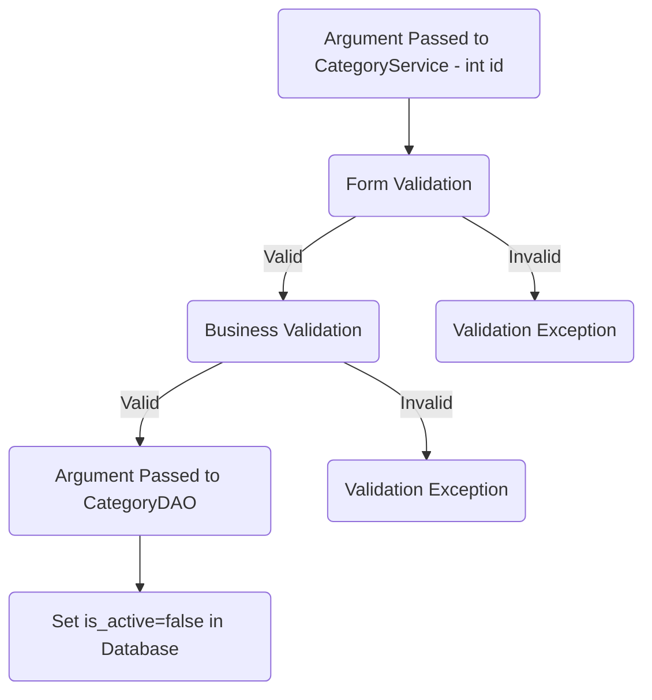
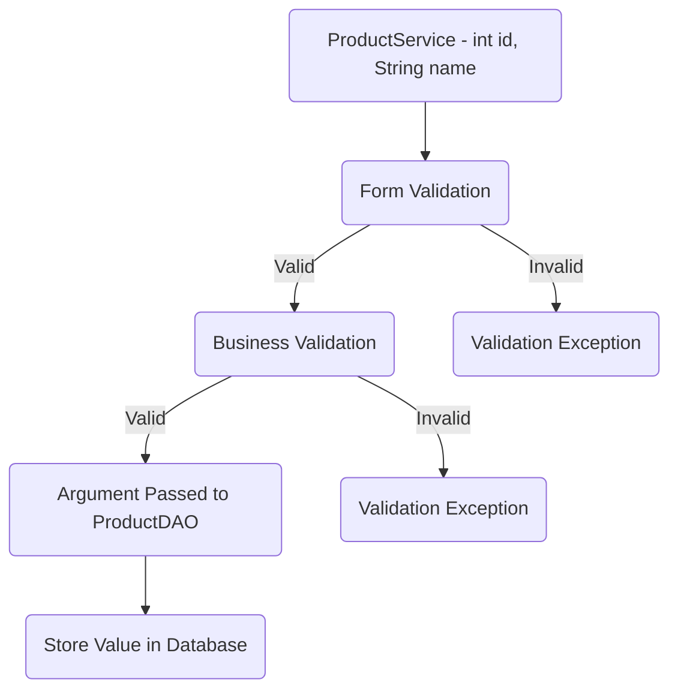

# Todo Application Checklist

## Database Design

- [ ] Create an ER diagram of the database
- [ ] Write Create table scripts [script](path/to/sql/file)


## Project Setup

- [ ] Create a new Java project
- [ ] Set up a MySQL database
- [ ] Add necessary libraries
	- [ ] JDBC, 
	- [ ] MySQL Connector, 
	- [ ] JUnit, 
	- [ ] Dotenv


## Module 1: Category

​

* Attributes  

	* int cate_id; 
  	* String name;  
	* Boolean isActive;  
​

### Feature 1 : Create Category

​### User story :

​

		Category created and successfully category details stored in database.

​

### Pre-requisites:- [ ] category DAO(create category)  

​

- [ ] category table

- [ ] category model

- [ ] category DAO

- [ ] category service ( create )

​

#### Validations:  

​

- [ ] Form Validation  

	* category null  

	* name ( null, empty, pattern )  

​

- [ ] Business Validation  

	* Category name Already exists

​

#### Messages:  

​

* Category object cannot be null  

* Name cannot be null or empty

* Name should be match with the given pattern  

* Category already exists  

​

#### Flow:  

​

> Invalid When a category's name is already in use or when the input provided does not meet the criteria, categories arise.

​


​

### Feature 2 : List all categories

​

### User story :

​

		List all categories stored in the database.

​

### Pre-requisites :- [ ] category DAO (findAll category)

​

- [ ] complete feature 1 - create category

- [ ]  category dao ( find all )

- [ ] category service ( find all )

​

### Flow:  
> Invalid When a category's name is not in use or when the input provided does not meet the criteria, categories arise.


​

### Feature 3 : Update Category

​ 
### User story :

​

		Category deatils are successfully updated and stored in databse.

​

### Pre-requisites:- [ ] category DAO(update category)  

​

- [ ] complete feature 4 - create category

- [ ] category dao ( create )

- [ ] category service ( create )

​

#### Validations:  

​

- [ ] Form Validation 

	* id (less than 0) 

	* name ( null, empty, pattern )  

​

- [ ] Business Validation  

	* Check whether the id exist

​

#### Messages:  

* Id cannot be 0 or in negative  

* Name cannot be null or empty

* Name should be match with the given pattern   

* Category id does not exists  

​

#### Flow:  

> Invalid When a category's name is not in use or when the input provided does not meet the criteria, categories arise.

​


### Feature 4 : Delete Category

​

### User story :

​	Category is deleted successfully.

​

### Pre-requisites:- [ ] category DAO(delete category)  

​

- [ ] complete feature 1 - create category

- [ ] category dao ( delete )

- [ ] category service ( delete )

​

#### Validations:  

​

- [ ] Form Validation 

	* id (less than or equal to 0) 

	* name (null, empty, pattern)

​

- [ ]  Business Validation  

	* Check whether the id or name exists

​

#### Messages:

* Id cannot be 0 or in negative

* Name cannot be null or empty

* Name should be match with the given pattern

* Category id or name does not exists 

​

#### Flow:  

> Invalid When a category's name is not in use or when the input provided does not meet the criteria, categories arise.

​



## Module 2: Product
   Attributes
   * int id
   * String name
   * Boolean  is_active
   * int  category_id
   
### Feature 1: Create Product
#### Product Story:
Product created Successfully and the product details will be stored in database.
#### Pre-requisites:
-
- [ ] complete category table
- [ ] Create product table
- [ ] product model
- [ ] product DAO
- [ ]  Product Service( create )

#### Validations:
- [ ] Form Validation
* Product( null )
* name( null , empty , pattern)
- [ ] Business Validation
* Product name Already exists 
#### Messages:
* Product object Can not be null
* Name can not be null or empty
* Name should be match with the given pattern


#### Flow:  
> Invalid When a category's name is already in use or when the input provided does not meet the criteria, categories arise.

​


​
#### Feature 2: List all products
 
#### Product Story:

List all Products stored in the database.

#### Pre-requisites:
- [ ] Products DAO ( findAll products)  
- [ ] complete feature 1- create Product
- [ ] Product DAO (find all)
- [ ] Product Service(find all)


#### Flow:


### Feature  3: List products By Category_id
### Product Story:
Products are successfully listed by Category id.

### Pre-requisites :-
- [ ] Complete create products
- [ ] Category dao (findById)
- [ ] Category service (findById)

### Validations :-

 - [ ] Form Validation 
    * id (less than 0) 
    * name ( null, empty, pattern )  
- [ ] Business Validation  
    * Check whether the id exist

#### Messages:  

* Id cannot be 0 or in negative  
* Category id does not exists


#### Flow:  

> Invalid When a Product's name is not in use or when the input provided does not meet the criteria, categories arise.

​


### Feature  4: Update Product

### Product story :

        Products deatils are successfully updated and stored in databse.


### Pre-requisites :
- [ ] Product DAO (Update Product)
- [ ] complete feature 1- create product
- [ ] product dao ( Update)
- [ ] product service ( Update)

#### Validations:  

- [ ] Form Validation 

    * id (less than 0) 

    * name ( null, empty, pattern )  

- [ ] Business Validation  

    * Check whether the id exist

#### Messages:  

* Id cannot be 0 or in negative  

* Name cannot be null or empty

* Name should be match with the given pattern   

* Product id does not exists


#### Flow:  

> Invalid When a Product's name is not in use or when the input provided does not meet the criteria, categories arise.

​


### Feature 5: Delete Product


### User story :

​
Product is deleted successfully.

### Pre-requisites:
- [ ] Product DAO(delete Product)  
- [ ] complete feature 1 - create Product
- [ ] Product dao ( delete )
- [ ] Product service ( delete )

​

#### Validations:  


- [ ] Form Validation 

	* id (less than or equal to 0) 

	* name (null, empty, pattern)

- [ ]  Business Validation  

	* Check whether the id or name exists

​

#### Messages:

* Id cannot be 0 or in negative

* Name cannot be null or empty

* Name should be match with the given pattern

* Product id or name does not exists 

​

#### Flow:  

> Invalid When a Product's name is not in use or when the input provided does not meet the criteria, categories arise.

​

```mermaid  

graph TD;  


A(Argument Passed to Product Service - int id) --> B(Form Validation) -- Valid --> C(Business Validation) 

B -- Invalid --> G(Validation Exception) 

C -- Valid --> D(Argument Passed to Product DAO)  

D --> E(Set is_active=false in Database)  

C -- Invalid --> F(Validation Exception) 

